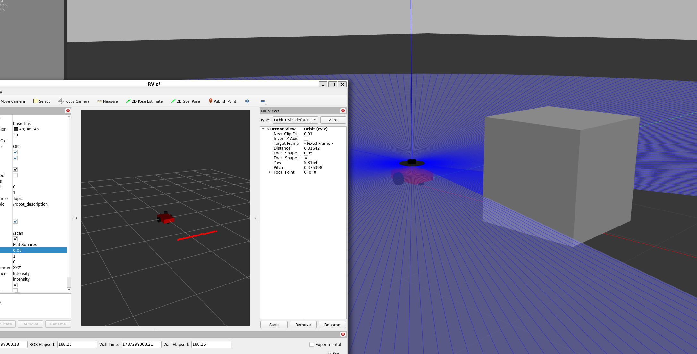

# ROS2 Differential Drive Robot

A differential-drive mobile robot developed with ROS 2 Humble, Gazebo, RViz2, and SLAM Toolbox.



## Project Overview

This project focuses on the development of a differential-drive mobile robot using ROS 2.

The robot is first developed and tested in simulation using Gazebo and RViz2. The project currently includes robot modeling, keyboard teleoperation, simulated LiDAR, odometry, and SLAM-based 2D mapping.

The simulation environment provides a foundation for later autonomous navigation and hardware integration.

## Features

- Differential-drive robot model using URDF
- Gazebo simulation
- RViz2 visualization
- Keyboard teleoperation using `/cmd_vel`
- Simulated 2D LiDAR publishing `/scan`
- Odometry publishing `/odom`
- SLAM Toolbox integration
- 2D map generation and saving
- Single-command Gazebo simulation launch

## Prerequisites & Dependencies

Tested environment:

- Ubuntu 22.04
- ROS 2 Humble
- Gazebo
- RViz2
- SLAM Toolbox
- teleop_twist_keyboard

Source ROS 2:

```bash
source /opt/ros/humble/setup.bash
```

Install the required dependencies using `rosdep`:

```bash
cd ~/ros2_ws
rosdep install --from-paths src --ignore-src -r -y
```

## Build Instructions

Create a ROS 2 workspace and clone the repository:

```bash
mkdir -p ~/ros2_ws
cd ~/ros2_ws
git clone https://github.com/Jiangnan-NN/ros2-diff-drive-robot.git .
```

Source ROS 2:

```bash
source /opt/ros/humble/setup.bash
```

Install dependencies:

```bash
rosdep install --from-paths src --ignore-src -r -y
```

Build the workspace:

```bash
colcon build
```

Source the workspace:

```bash
source install/setup.bash
```

## Running the Simulation

Start Gazebo and spawn the differential-drive robot:

```bash
cd ~/ros2_ws
source /opt/ros/humble/setup.bash
source install/setup.bash

ros2 launch robot_description simulation.launch.py
```

This launch file starts Gazebo, loads the robot URDF, starts `robot_state_publisher`, and spawns the robot into the simulation environment.

## Keyboard Control

Open a second terminal and run:

```bash
source /opt/ros/humble/setup.bash
source ~/ros2_ws/install/setup.bash

ros2 run teleop_twist_keyboard teleop_twist_keyboard
```

Keyboard velocity commands are published on:

```text
/cmd_vel
```

The Gazebo differential-drive plugin converts these commands into wheel motion.

## LiDAR and SLAM

The simulated 2D LiDAR publishes laser scan data on:

```text
/scan
```

The robot also publishes odometry data on:

```text
/odom
```

SLAM Toolbox uses the LiDAR and odometry data to build a 2D occupancy map of the simulated environment.

Generated maps are stored in:

```text
maps/
```

The current saved map files are:

```text
my_map.pgm
my_map.yaml
```

## Directory Structure

```text
ros2-diff-drive-robot/
├── README.md
├── docs/
│   └── images/
│       └── gazebo_robot.png
├── maps/
│   ├── my_map.pgm
│   └── my_map.yaml
└── src/
    └── robot_description/
        ├── CMakeLists.txt
        ├── package.xml
        ├── config/
        │   └── slam_params.yaml
        ├── launch/
        │   ├── display.launch.py
        │   └── simulation.launch.py
        └── urdf/
            └── robot.urdf
```

### Main Directories

- `urdf/` — Robot geometry, joints, sensors, and Gazebo plugins
- `launch/` — ROS 2 launch files used to start the robot and simulation
- `config/` — Configuration files for SLAM and future navigation
- `maps/` — Maps generated using SLAM Toolbox
- `docs/images/` — Screenshots and other project visuals

## Development Progress

### Week 1 — ROS 2 Environment Setup

- Installed Ubuntu 22.04 using WSL2
- Installed ROS 2 Humble
- Tested ROS 2 publisher/subscriber communication
- Created the ROS 2 workspace
- Installed and tested `colcon`
- Set up Git and GitHub version control

### Week 2 — Robot Model and Simulation

- Created a differential-drive robot model using URDF
- Added chassis, drive wheels, and caster wheel
- Visualized the robot model in RViz2
- Spawned the robot in Gazebo
- Added differential-drive control
- Implemented keyboard teleoperation

### Week 3 — LiDAR and SLAM

- Added simulated 2D LiDAR
- Published LaserScan data on `/scan`
- Visualized LiDAR data in RViz2
- Integrated SLAM Toolbox
- Generated a 2D map of the simulated environment
- Saved the generated map

## Repository Improvements

The repository was reorganized to improve reproducibility and readability:

- Added structured `config/`, `maps/`, and `docs/images/` directories
- Added ROS 2 dependencies to `package.xml`
- Improved installation rules in `CMakeLists.txt`
- Added a single Gazebo simulation launch file
- Added reproducible dependency installation using `rosdep`
- Added copy-pasteable build and run instructions
- Added project visuals and directory documentation

### Week 4 – Navigation in Simulation

- Configured the Nav2 stack
- Loaded the saved map and set up AMCL localization
- Tested autonomous navigation to target goals
- Created a larger map for navigation testing
- Tuned Nav2 controller and planner parameters
- Improved navigation stability and smoothness

### Week 5 – Hardware Assembly

- Physical robot assembly is handled by the company
- Hardware components will be provided pre-assembled
- Continued with software preparation for Week 6

## Next Steps

- Prepare Arduino motor and encoder control firmware
- Configure ROS 2 interface for encoder data
- Integrate the RPLIDAR A1 ROS 2 driver
- Publish and verify the `/scan` topic
- Implement wheel odometry and publish `/odom`
- Prepare the software stack for physical robot testing
